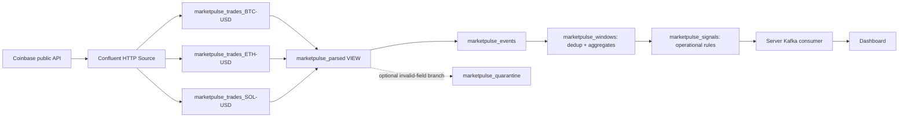

# MarketPulse cloud pipeline

**Revision 2 is prepared and cloud-unverified.** Check actual connector/statement state in Confluent Cloud; these files do not establish launch or execution.

The core uses real public Coinbase samples, three source topics and three continuous Flink jobs. A parsing view feeds valid events; bounded window deduplication removes repeated polls before aggregation; transparent operational rules create dashboard signals. Quarantine is an optional fourth job.

This is intended logical design, not deployed Stream Lineage evidence. The view has no stored data; Confluent reserves its name with a metadata-only topic. It may appear expanded in the cloud graph. [execution-plan.md](execution-plan.md) gives the statement sequence; [validation.sql](validation.sql) contains inspections.

## Signal contract

| Field | SQL type | Meaning |
| --- | --- | --- |
| symbol | STRING | BTC-USD, ETH-USD, SOL-USD |
| window_end | TIMESTAMP(3) | Exclusive end of 30-second UTC event-time window |
| observed_trades | BIGINT | Unique sampled trade IDs after deduplication |
| observed_notional | DOUBLE | Sum(price × size), USD, approximate |
| observed_quantity | DOUBLE | Sum(size), product base units, approximate |
| sample_vwap | DOUBLE | Sample notional / quantity |
| price_range_pct | DOUBLE | (max price / min price − 1) × 100 |
| taker_buy_pct | DOUBLE | Maker-side sell quantity / all quantity × 100 |
| sample_span_seconds | BIGINT | Integer seconds between first/last sampled trade |
| operational_signal | STRING | Ordered rules below |
| model_status | STRING | NOT_CONFIGURED; no model running |
| forecast_trades, lower_bound, upper_bound | Nullable DOUBLE | Always null in revision 2 |
| signal | STRING | Legacy WARMING_UP value; UI should prefer model_status |

Rules run in order: LOW_SAMPLE for fewer than 10 trades or less than 10 seconds of sample span; WIDE_PRICE_RANGE for range at least 0.5%; BUY_PRESSURE for taker-buy share at least 80%; SELL_PRESSURE for share at most 20%; otherwise OBSERVING. These are demo triage thresholds, not calibrated predictions or trading recommendations. [source-schema.json](source-schema.json) describes expected input; inspect generated cloud schemas after creation.

## Scope and limitations

The configured connector requests up to 1,000 latest trades per product every 10 seconds. Poll overlap creates duplicates; busy intervals can have unobserved trades. Counts/notional describe samples, never entire venue volume or completeness. Dedup assumes repeated product/trade IDs retain original timestamps/payloads. Events behind the watermark can be discarded. Silence creates no zero-volume row: use server freshness monitoring.

Coinbase side is maker side; taker side is opposite. Coinbase is publicly accessible market data, not an assertion of an open-data license; provider terms apply. Quarantine catches deserializable field-validation failures, not corrupt Kafka bytes or connector errors.

Forecast fields are deliberately null because the old current-versus-future comparison was not timestamp-aligned. Operational rules run independently. No model accuracy, financial impact or globally unique invention is claimed.

Historical operator identifiers: env-w0kdo9; cluster marketpulse/lkc-7ykmgx1, GCP us-east1; connector service account sa-d9mqdyy. Verify current state. Never put secrets in this directory or Pages. Connector, Kafka and Flink usage consume cloud resources; pool limits may prevent simultaneous startup.

## Official references checked

- [Materialized tables](https://docs.confluent.io/cloud/current/flink/reference/statements/create-materialized-table.html): output topic, schema and persistent query lifecycle.
- [CREATE VIEW](https://docs.confluent.io/cloud/current/flink/reference/statements/create-view.html): shared logical query.
- [Window deduplication](https://docs.confluent.io/cloud/current/flink/reference/queries/window-deduplication.html): window keys and row-number pattern.
- [Window aggregation](https://docs.confluent.io/cloud/current/flink/reference/queries/window-aggregation.html): final windows and bounded state.
- [Table and watermark options](https://docs.confluent.io/cloud/current/flink/reference/statements/create-table.html): JSON Schema output and event-time tolerance.
- [Forecast timestamps](https://docs.confluent.io/cloud/current/ai/builtin-functions/forecast.html): align future horizons to their actual target.
- [Coinbase product trades](https://docs.cdp.coinbase.com/api-reference/exchange-api/rest-api/products/get-product-trades).
- [HTTP Source connector](https://docs.confluent.io/cloud/current/connectors/cc-http-source.html).

Challenge screenshots provide submission context. No form is submitted by this pipeline.
